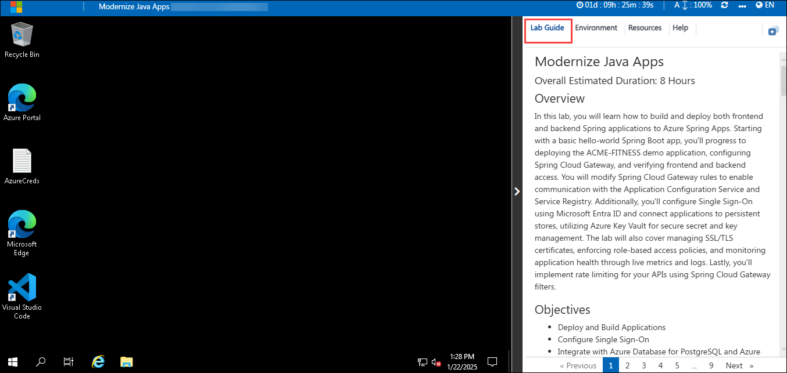
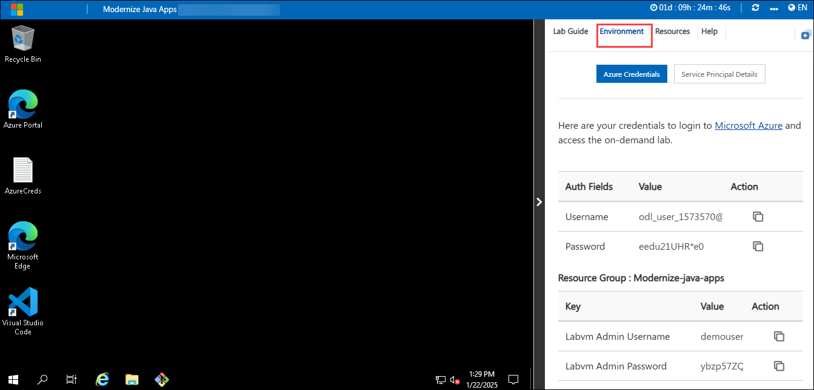
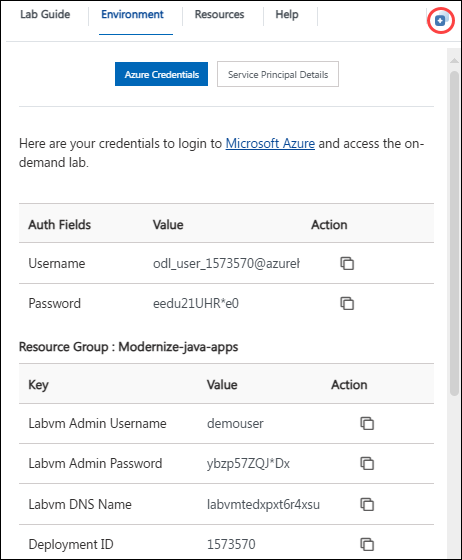
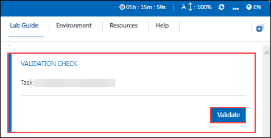
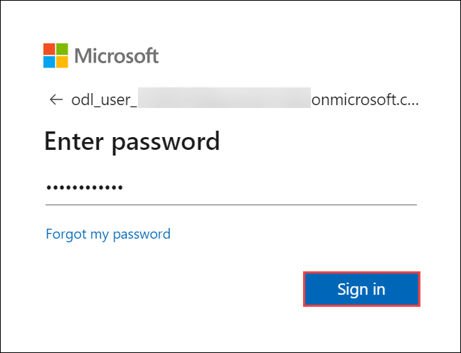

# Modernize Java Apps

### Overall Estimated Duration: 8 Hours

## Overview

In this lab, you will learn how to build and deploy both frontend and backend Spring applications to Azure Spring Apps. Starting with a basic hello-world Spring Boot app, you'll progress to deploying the ACME-FITNESS demo application, configuring Spring Cloud Gateway, and verifying frontend and backend access. You will modify Spring Cloud Gateway rules to enable communication with the Application Configuration Service and Service Registry. Additionally, you'll configure Single Sign-On using Microsoft Entra ID and connect applications to persistent stores, utilizing Azure Key Vault for secure secret and key management. The lab will also cover managing SSL/TLS certificates, enforcing role-based access policies, and monitoring application health through live metrics and logs. Lastly, you'll implement rate limiting for your APIs using Spring Cloud Gateway filters.

## Objectives

- Deploy and Build Applications
- Configure Single Sign-On
- Integrate with Azure Database for PostgreSQL and Azure Cache for Redis
- Load Application Secrets using Key Vault
- Monitor Applications End-to-End (Optional)
- Change the Application Code and Set Request Rate Limit (Optional)
- Automate from idea to production
- Infuse AI into Fitness Store

## Pre-Requisites

- Basic Understanding of Spring Boot
- Frontend-Backend Architecture Knowledge:

## Architecture Diagram

   

## Getting Started with the Lab
Welcome to your Automate-document-processing-using-AzureOpenAI Workshop! We've prepared a seamless environment for you to explore and learn about Azure services. Let's begin by making the most of this experience.
 
## Accessing Your Lab Environment
 
Once you're ready to dive in, your virtual machine and lab guide will be right at your fingertips within your web browser.

  

 
## Exploring Your Lab Resources
 
To get a better understanding of your lab resources and credentials, navigate to the **Environment** tab.
 
  
 
## Utilizing the Split Window Feature
 
For convenience, you can open the lab guide in a separate window by selecting the **Split Window** button from the Top right corner.
 
  

## Managing Your Virtual Machine
 
Feel free to start, stop, or restart your virtual machine as needed from the **Resources** tab. Your experience is in your hands!

  

## Lab Validation

1. After completing the task, hit the **Validate** button under Validation tab integrated within your lab guide. If you receive a success message, you can proceed to the next task, if not, carefully read the error message and retry the step, following the instructions in the lab guide.

   

## Lab Guide Zoom In/Zoom Out
 
1. To adjust the zoom level for the environment page, click the **A↕ : 100%** icon located next to the timer in the lab environment.

     

## Let's Get Started with Azure Portal
 
1. On your virtual machine, click on the **Azure Portal** icon as shown below:
 
    .png)

1. On the **Sign in to Microsoft Azure** tab you will see the login screen, in that enter the following email/username, and click on **Next**. 

   * **Email/Username**: <inject key="AzureAdUserEmail"></inject>
   
      
     
1. Now enter the following password and click on **Sign in**.
   
   * **Password**: <inject key="AzureAdUserPassword"></inject>
   
      
     
   > If you see the **Help us protect your account** dialog box, then select the **Skip for now** option.

      
  
1. If you see the pop-up **Stay Signed in?**, click No

1. If you see the pop-up **You have free Azure Advisor recommendations!**, close the window to continue the lab.

1. If a **Welcome to Microsoft Azure** popup window appears, click **Maybe Later** to skip the tour.
   
1. Now you will see the Azure Portal Dashboard, click on **Resource groups** from the Navigate panel to see the resource groups.

   
   
1. Confirm that you have all resource groups present as shown below. Open the **Modernize-java-apps** resource group and verify the resources present in it.

   
   
1. Now, click on the **Next** from the lower right corner to move to the next page.

## Support Contact
The CloudLabs support team is available 24/7, 365 days a year, via email and live chat to ensure seamless assistance at any time. We offer dedicated support channels tailored specifically for both learners and instructors, ensuring that all your needs are promptly and efficiently addressed.

Learner Support Contacts:

* Email Support: cloudlabs-support@spektrasystems.com
* Live Chat Support: https://cloudlabs.ai/labs-support
  
Now, click on Next from the lower right corner to move on to the next page.

### Happy Learning!!
