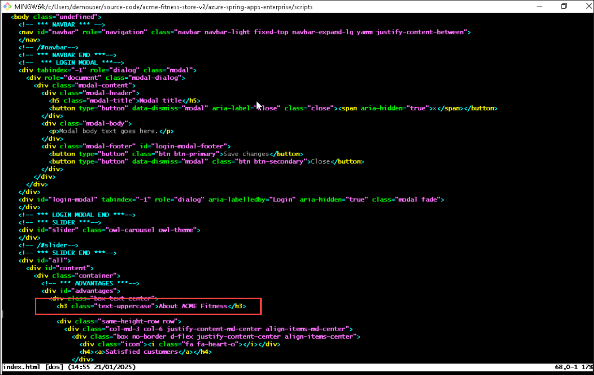
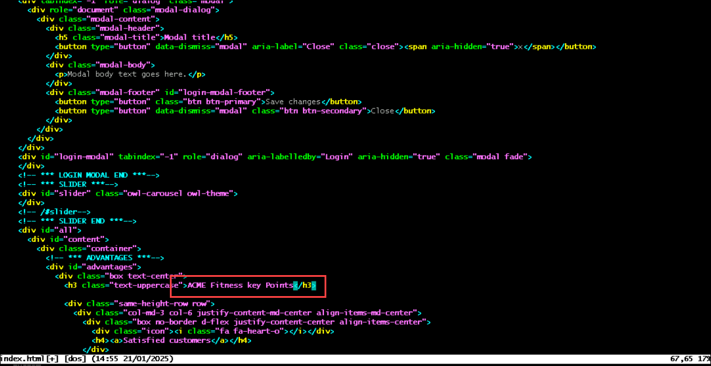

# Lab 6: Change the Application Code and Set Request Rate Limit (Optional)

### Estimated Duration: 10 minutes

## Overview

In this exercise, you will be updating the source code of the application and the spring application.

## Lab Objectives

- Task 1: change the Application Code and Update Settings

### Task 1: change the Application Code and Update Settings

1. Navigate back to the Git Bash window and run the below command to open the index file where you will be making the code changes. 

     ```bash
     
     cd ../../apps/acme-shopping/public/
     vi index.html
     ```

      > **Note:** Please note the names of the resources in below images may very with the resources you created in the lab. 

2. The index.html file will open with Code Editor, now in line number **67**, update the value from **About ACME Fitness** to **ACME Fitness key Points** and save the file using the **:wq!** or you can use visual studio code editor and update the field as per your convenience.

     

     

3. Once the changes are done, you will be publishing a new staging deployment to the frontend application.

4. Run the below command in the Git Bash to create a new deployment named as **staging-update** for the frontend application.

    ```bash
    az spring app deployment create --name green --app ${FRONTEND_APP} --source-path ../../../apps/acme-shopping 
    ```
  
    > **Note:** Please note that the above command can run for up to 10 minutes. Wait until it runs successfully. if you face any issues on source path while running the command, you can provide full path mentioned in step one.

  
5. Once the creation of the new deployment is completed, navigate back to Azure Spring Apps named **<inject key="Spring App Name" enableCopy="true" />** **(1)** in Azure Portal. Then click on **Apps** **(2)** from the left menu under Settings and select **frontend** **(3)** app from the list.

      
    
6. In **frontend** App pane, click on **Deployments** **(1)** from the left menu under Settings and click on the **Staging** **(2)** hyperlink next to **green** deployment to verify the new staging deployment to the frontend application
    
      
    
      
    
7. Now, we will be moving the **green** deployment to the production to see the changes from the production URL.

8. To set up the deployment to production, move back to the Git Bash window and run the below command:

    ```bash
    az spring app set-deployment --deployment green --name ${FRONTEND_APP}
    ```
    
      
    
9. Once the set deployment is completed, refresh the main application Gateway URL, and you should be able to see the changes in production. If you do not have the application open, run the below command to get the Gateway endpoint. (Copy the URL and paste it into a new browser.)

    ```bash
    echo "https://${GATEWAY_URL}"
    ```

     


### Task 2: Spring Cloud Gateway Rate Limit Filter (Read-only)

Spring Cloud Gateway includes route filters from the Open Source version as well as several additional route filters. One of these additional filters is the [RateLimit: Limiting user requests filter](https://docs.vmware.com/en/VMware-Spring-Cloud-Gateway-for-Kubernetes/1.1/scg-k8s/GUID-route-filters.html#ratelimit-limiting-user-requests-filter). The RateLimit filter limits the number of requests allowed per route during a time window.

   When defining a route, you can add the RateLimit filter by including it in the list of filters for the route. The filter accepts four options:

   * Number of requests accepted during the window.
   * Duration of the window: by default milliseconds, but you can use the s, m, or h suffix to specify it in seconds, minutes, or hours.
   * (Optional) User partition key: it's also possible to apply rate limiting per user, that is, different users can have their throughput allowed based on an identifier found in the request. Set whether the key is in a JWT claim or HTTP header with '' or '' syntax.
   * (Optional) It is possible to rate limit by IP addresses. Note, that this cannot be combined with the rate-limiting per user.

   > **Note:** The following example would limit all users to two requests every 5 seconds to the `/products` route.

   ```json
   {
      "predicates": [
         "Path=/products",
         "Method=GET"
      ],
      "filters": [
         "StripPrefix=0",
         "RateLimit=2,5s"
      ]
   }
   ```

When the limit is exceeded, the response will fail with `429 Too Many Requests` status.

### Task 3: Update Spring Cloud Gateway Routes

1. To apply the `RateLimit` filter to the `/products` route, run the following command:

   ```bash
   az spring gateway route-config update \
      --name ${CATALOG_SERVICE_APP} \
      --app-name ${CATALOG_SERVICE_APP} \
      --routes-file ../../../azure-spring-apps-enterprise/resources/json/routes/catalog-service_rate-limit.json
   ```

   
   
   
   > **Note:** Make sure you are using the same Git Bash window without closing it from the previous exercise.

### Task 4: Verify Request Rate Limits

1. To retrieve the URL for the `/products` route in Spring Cloud Gateway, use the following command:

   ```bash
   GATEWAY_URL=$(az spring gateway show | jq -r '.properties.url')
   echo "https://${GATEWAY_URL}/products"
   ```

     > **Note:** Copy the output URL and paste it into a new browser. Make several requests to the URL for `/products` within a five-second period to see requests fail with the status `429 Too Many Requests`.
   
    


> Now, click on **Next** in the lab guide section in the bottom right corner to jump to the next exercise instructions.
