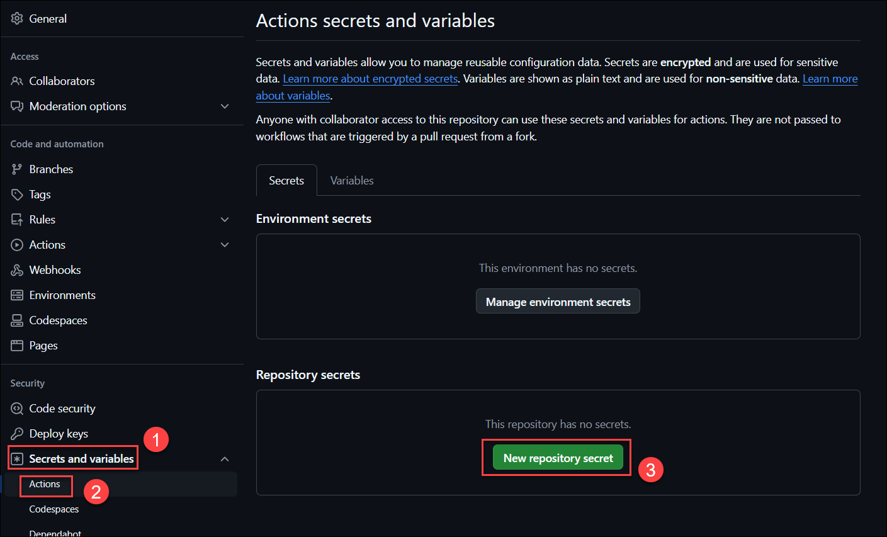

# Lab 7:  Automate from idea to production

### Estimated Duration: 40 minutes

## Overview

In this lab, you will use Spring Cloud Gateway filters to apply rate limiting to your API.

## Lab Objectives

- Task 1: Prepare your environment for creating a Storage Account
- Task 2: Add Secrets to GitHub Actions

### Task 1: Prepare your environment for creating a Storage Account

1. Make sure you are operating from the ./scripts folder.

      ```shell
      cd ../../../azure-spring-apps-enterprise/scripts/
      ```
      ```shell
      pwd
      ```

2. Create a bash script with environment variables by making a copy of the supplied template:.

    ```shell
    cp ./setup-storage-env-variables-template.sh ./setup-storage-env-variables.sh
    ```

3. Using an editor of your choice, edit the file, (for the purposes of example we will use the vi editor), and add the following values.

    ```shell
    vi setup-storage-env-variables.sh 
    ```

4. Press **i** to enter the below information and then press **Ctrl + C** and **:wq** to save.

    ```shell
    export STORAGE_RESOURCE_GROUP=''      
    export STORAGE_ACCOUNT_NAME=''        
    ```
            
            - Replace STORAGE_RESOURCE_GROUP with Modernize-java-apps
            - Replace STORAGE_ACCOUNT_NAME with storage<inject key="DeploymentID"></inject>

5. Then, set the environment.

    ```shell
    source ./setup-storage-env-variables.sh
    ```

6. Create a resource group to hold the Storage Account.

    ```shell
    az group create \
      --name ${STORAGE_RESOURCE_GROUP} \
      --location ${REGION}
    ```

      > **Note:**  Replace STORAGE_RESOURCE_GROUP with **Modernize-java-apps** and region with **<inject key="Region" enableCopy="true"/>**

7. Create a Storage Account in resource group.

    ```shell
    az storage account create \
      --name ${STORAGE_ACCOUNT_NAME} \
      --resource-group ${STORAGE_RESOURCE_GROUP} \
      --location ${REGION} \
      --sku Standard_RAGRS \
      --kind StorageV2
    ```

      > **Note:** Update the values for ${STORAGE_ACCOUNT_NAME}, ${STORAGE_RESOURCE_GROUP} and ${REGION}.

8. Create a Storage Container within the Storage Account.

    ```shell
    az storage container create \
        --name terraform-state-container \
        --account-name ${STORAGE_ACCOUNT_NAME} \
        --auth-mode login
    ```

      > **Note:** Update the values for ${STORAGE_ACCOUNT_NAME}.

9. Create a service principal with enough scope/role to manage your Azure Spring Apps instance.

    ```shell
    az ad sp create-for-rbac --name "change-me" \
       --role contributor \
       --scopes /subscriptions/${SUBSCRIPTION} \
       --sdk-auth
    ```

    > **Note:** Replace SubscriptionID: **<inject key="Subscription Id" enableCopy="true"/>**
    > **Note:** Make the name of the service principle something you will recognize.

9. Copy the Result and save it for later use.

    ```json
    {
        "clientId": "<GUID>",
        "clientSecret": "<GUID>",
        "subscriptionId": "<GUID>",
        "tenantId": "<GUID>",
        "activeDirectoryEndpointUrl": "https://login.microsoftonline.com",
        "resourceManagerEndpointUrl": "https://management.azure.com/",
        "sqlManagementEndpointUrl": "https://management.core.windows.net:8443/",
        "galleryEndpointUrl": "https://gallery.azure.com/",
        "managementEndpointUrl": "https://management.core.windows.net/"
    }
    ```

    > This output will be needed as a secret value for the next step.   Save this off to a file, in a secure location that you can reference later.

### Task 2: Add Secrets to GitHub Actions

1. From the new browser tab, go to [GitHub](https://github.com/) and log in to your account.

      > **Note:** If you don't have an account for GitHub, please sign up.

1. After the login, go to [https://github.com/CloudLabsAI-Azure/acme-fitness-store-v2](https://github.com/Azure-Samples/acme-fitness-store.git) and click on `Fork`.

     
   
1. On the Create a new fork page, click on Create fork. 

1. Now you're going to add the secrets to your repo.

1. From your repo, click on **Settings**.

     

1. Find **Secrets and variables** **(1)** under _Security_ on the left side of menu, and click on **Actions** **(2)**. After that Click on **New repository secret** **(3)**.
  
     
   
1. Type `AZURE_CREDENTIALS` **(1)** for the Name of the secret, enter the following code under Secret and make sure to replace the values of **ClientId (Application Id)**, **ClientSecret (Secret Key)**, **Subscription_ID** and **TenantId (Directory ID)** **(2)** and then click on **Add Secret** **(3)**.   

     ```json
    {
        "clientId": "Application_ID",
        "clientSecret": "Application_secret",
        "subscriptionId": "Subscription_ID",
        "tenantId": "TENANT_ID",
        "activeDirectoryEndpointUrl": "https://login.microsoftonline.com",
        "resourceManagerEndpointUrl": "https://management.azure.com/",
        "sqlManagementEndpointUrl": "https://management.core.windows.net:8443/",
        "galleryEndpointUrl": "https://gallery.azure.com/",
        "managementEndpointUrl": "https://management.core.windows.net/"
    }
    ```
     
     > **Note:** You can copy the **ClientId (Application Id)**, **ClientSecret (Secret Key)**, **Subscription_ID** and **TenantId (Directory ID)** from the Environment details page > Service principal details.

     

1. In a similar way, you will add the following secrets to GitHub Actions:

   | Secret Name | Secret value|
   |:----------|:--------|
   | `RESOURCE_GROUP`| Provide the RG name **<inject key="Resource Group Name" />**|
   | `KEYVAULT`| Provide the Key vault name **<inject key="KeyVault Name" />**|
   | `AZURE_LOCATION` | Provide the region **<inject key="Region" />**|
   | `OIDC_JWK_SET_URI` | use the `JWK_SET_URI` |
   | `OIDC_CLIENT_ID` | use the `CLIENT_ID` |
   | `OIDC_CLIENT_SECRET` | use the `CLIENT_SECRET`|
   | `OIDC_ISSUER_URI` | use the `ISSUER_URI`|
 
      > **Note**: For the values of `OIDC_JWK_SET_URI`, `OIDC_CLIENT_ID`, `OIDC_CLIENT_SECRET`, `OIDC_ISSUER_URI`, enter the values you have copied in your text editor in Lab 2.


1. Add the secret `TF_BACKEND_CONFIG` to GitHub Actions with the value replacing `${STORAGE_ACCOUNT_NAME}` with and `${STORAGE_RESOURCE_GROUP}` with the resource group.

   ```text
   resource_group_name  = "${STORAGE_RESOURCE_GROUP}"
   storage_account_name = "${STORAGE_ACCOUNT_NAME}"
   container_name       = "terraform-state-container"
   key                  = "dev.terraform.tfstate"
   ```

      > **Note**: Go to the Azure Portal, search for "Storage Account," and use it along with its associated resource group (RG).

     

1. From the forked repo, click on **Actions**.

1. Select **Deploy catalog** (1) under __Actions_ All workflows_ from the left side panel and click on **Run workflow** (2). After that Click on **Run workflow** (3) under _Branch: Azure_.

     

1. Each application has a `Deploy` workflow that will redeploy the application when changes are made to that application. An example output from the catalog service is shown below:

     

>**Congratulations** on completing the Task! Now, it's time to validate it. Here are the steps:
> - Hit the Validate button for the corresponding task. If you receive a success message, you have successfully validated the lab. 
> - If not, carefully read the error message and retry the step, following the instructions in the lab guide.
> - If you need any assistance, please contact us at cloudlabs-support@spektrasystems.com.

   <validation step="e01d76e9-8ff7-4829-8c6d-ffc5f41c343e" />

## Summary

In this lab, you have prepared your environment for creating a Storage Account and added Secrets to GitHub Actions.

### You have successfully completed the lab!
