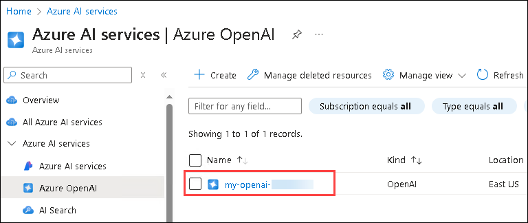
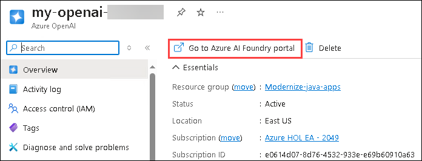
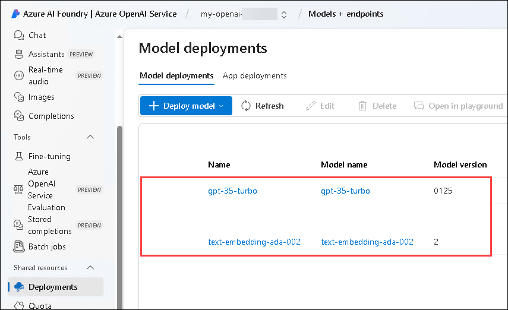
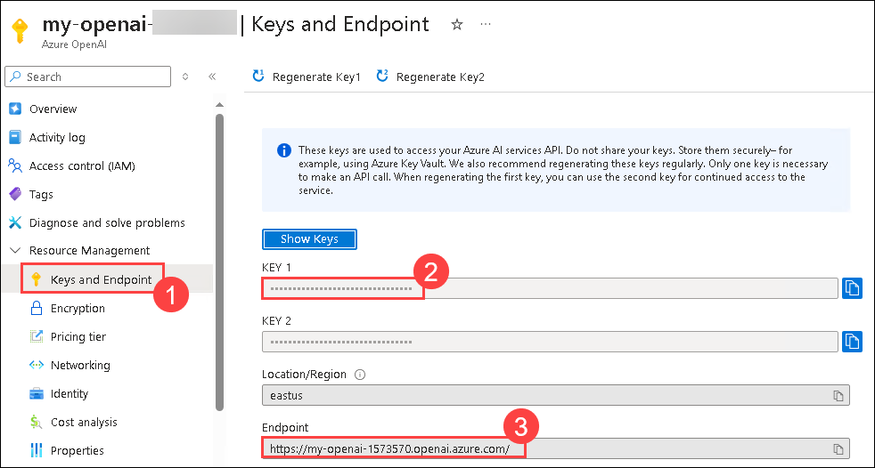

# Lab 8: Infuse AI into Fitness Store

### Estimated Duration: 30 minutes

## Lab Objectives

- Task 1: Prepare the Environment Variables
- Task 2: Prepare Azure OpenAI
- Task 3: Build and Deploy Assist app to Azure Spring Apps

### Task 1: Prepare the Environment Variables

1. Please navigate to the root folder of this cloned repository.

2. Copy the AI environment variables template file, make sure you are in ./scripts directory.

   ```bash
    cp ./setup-ai-env-variables-template.sh ./setup-ai-env-variables.sh
   ```

3. Update the values in `./setup-ai-env-variables.sh` with the values as listed below:

   ```bash
     vi setup-ai-env-variables.sh
     source ./setup-ai-env-variables.sh
   ```
 
  - OPENAI_RESOURCE_NAME: **my-openai-<inject key="Deployment ID" enableCopy="false"/>**
  - SPRING_AI_AZURE_OPENAI_ENDPOINT="your_azure_openai_endpoint" (will be adding it once the OPENAI service is deployed)
  - SPRING_AI_AZURE_OPENAI_API_KEY="your_api_key" (will be adding it once the OPENAI service is deployed)
  - SPRING_AI_AZURE_OPENAI_MODEL: ""
  - SPRING_AI_AZURE_OPENAI_EMBEDDINGMODEL: ""

### Task 2: Prepare Azure OpenAI 

1. Run the following command to create an Azure OpenAI resource in the the resource group.

   ```bash
      source ./setup-env-variables.sh
      export OPENAI_RESOURCE_NAME
      az cognitiveservices account create \
         -n ${OPENAI_RESOURCE_NAME} \
         -g ${RESOURCE_GROUP} \
         -l eastus \
         --kind OpenAI \
         --sku s0 \
         --custom-domain ${OPENAI_RESOURCE_NAME}   
   ```
   
   > Search for Azure OpenAI in the Azure Portal and verify if the resource has been created.

      

2. Create the model deployments for `text-embedding-ada-002` and `gpt-35-turbo` in your Azure OpenAI service.
   
    ```bash
    az cognitiveservices account deployment create \
       -g ${RESOURCE_GROUP} \
       -n ${OPENAI_RESOURCE_NAME} \
       --deployment-name text-embedding-ada-002 \
       --model-name text-embedding-ada-002 \
       --model-version "2"  \
       --model-format OpenAI \
       --sku "Standard" \
       --capacity 1
    
    az cognitiveservices account deployment create \
       -g ${RESOURCE_GROUP} \
       -n ${OPENAI_RESOURCE_NAME} \
       --deployment-name gpt-35-turbo \
       --model-name gpt-35-turbo \
       --model-version "0125"  \
       --model-format OpenAI \
       --sku "Standard" \
       --capacity 1
    ```

    - RESOURCE_GROUP: **Modernize-java-apps**
    - OPENAI_RESOURCE_NAME: **my-openai-<inject key="Deployment ID" enableCopy="false"/>**

    > Alternatively, you can go back to portal, select the OpenAI service which we created in step 1 of this task.
    > - Click on Go to Azure AI Foundry Portal.
    > - Navigate to Deployments from the left pane and verify your deployments.

      

      

4. Run the below command to update the values in `scripts/setup-ai-env-variables.sh`, 

      ```bash
        vi setup-ai-env-variables.sh
        source ./setup-ai-env-variables.sh
      ```

    * Navigate to the OpenAI Service you have created and select **Keys & Endpoint (1)** from the left pane.
      
    * Copy the **Primary Key (2)** and **Endpoint (3)** and paste it in the file.
    
          
    
5. You can get the endpoint by querying the `cognitiveservices` from Azure CLI, 

    ```bash
       az cognitiveservices account show \
         --name ${OPENAI_RESOURCE_NAME} \
         --resource-group ${RESOURCE_GROUP} \
         --output json | jq -r '.properties.endpoint' 
    ```

    - RESOURCE_GROUP: **Modernize-java-apps**
    - OPENAI_RESOURCE_NAME: **my-openai-<inject key="Deployment ID" enableCopy="false"/>**

### Task 3: Build and Deploy Assist app to Azure Spring Apps

1. Configure AI environment variables

   ```bash
      source ./setup-ai-env-variables.sh
   ```

2. Create the new AI service `assist-service`

   ```bash    
       az spring app create --name ${AI_APP} --instance-count 1 --memory 1Gi
   ```

3.  Configure Spring Cloud Gateway with the `assist-service` routes

   ```bash
       az spring gateway route-config create \
           --name ${AI_APP} \
           --app-name ${AI_APP} \
           --routes-file ../resources/json/routes/assist-service.json
   ```
    
4. Deploy the application 

   ```bash
       az spring app deploy --name ${AI_APP} \
           --source-path ../../apps/acme-assist \
           --build-env BP_JVM_VERSION=17 \
           --env \
               SPRING_AI_AZURE_OPENAI_ENDPOINT=${SPRING_AI_AZURE_OPENAI_ENDPOINT} \
               SPRING_AI_AZURE_OPENAI_API_KEY=${SPRING_AI_AZURE_OPENAI_API_KEY}
   ```

      > **Note:** For routes-file and source-path if you face any issues please crosscheck the paths and do modify the line of code accordingly for the route-file and source-path if command not able to find.

5. Test the `acme-fitness` application in the browser again. Go to `ASK TO FITASSIST` and converse with the assistant, e.g.

   ```
      I need a bike for a commute to work.
   ```

      

6. Observe the output that was generated by the Assist application, e.g.

     

      > **Note:** Output of the AI generated texts can be vary from the output shown in the image.

## **Congratulations! you have successfully completed the lab.**
